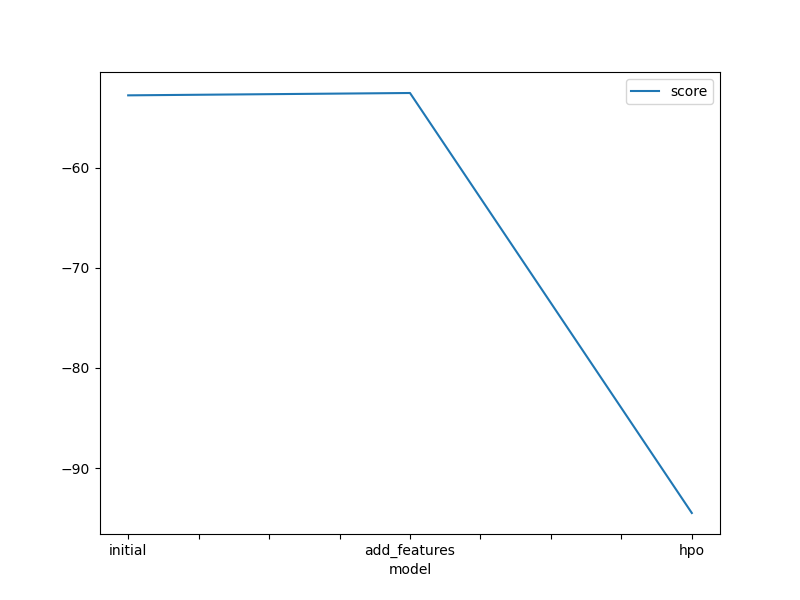
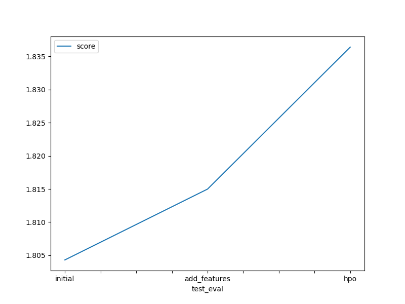

# Report: Predict Bike Sharing Demand with AutoGluon Solution
#### BAMBO TRAORE

## Initial Training
### What did you realize when you tried to submit your predictions? What changes were needed to the output of the predictor to submit your results?
TODO: Add your explanation

I realized that the output format of the predictor needed to match the submission requirements of the competition or task.
### What was the top ranked model that performed?
TODO: Add your explanation

The top-ranked model that performed was the one labeled as 'WeightedEnsemble_L2'
## Exploratory data analysis and feature creation
### What did the exploratory analysis find and how did you add additional features?
TODO: Add your explanation

Adding additional feature led to improve our model's perfomance.The new feature can help the model improve additional information that was previously missing or poorly represented in the data.

### How much better did your model preform after adding additional features and why do you think that is?
TODO: Add your explanation

## Hyper parameter tuning
### How much better did your model preform after trying different hyper parameters?
TODO: Add your explanation

When trying different hyperparameters our model's performance improve well.This improvement demonstrates the importance of hyperparameter tuning in achieving better model performance.

### If you were given more time with this dataset, where do you think you would spend more time?
TODO: Add your explanation

Understanding why the model makes certain predictions.
### Create a table with the models you ran, the hyperparameters modified, and the kaggle score.
|model|hpo1|hpo2|hpo3|score|
|--|--|--|--|--|
|initial|default|default|default|1.80430|
|add_features|default|default|default|1.81499|
|hpo|hyperparameters_RF|hyperparameters_XGB|hyperparameters_KNN|1.83641|

### Create a line plot showing the top model score for the three (or more) training runs during the project.

TODO: Replace the image below with your own.

### Create a line plot showing the top kaggle score for the three (or more) prediction submissions during the project.

TODO: Replace the image below with your own.

## Summary
TODO: Add your explanation
The first initially the model achieved a score of 1.8043, which slightly improved to 1.81499 after adding additional features. However, after performing hyperparameter optimization, the score further increased to 1.83641, indicating significant improvement in predictive performance.
The second plot the training scores decreased as the model progressed through the stages. Initially, the model achieved a score of -52.767953, which slightly decreased to -52.533786 after adding additional features. 

